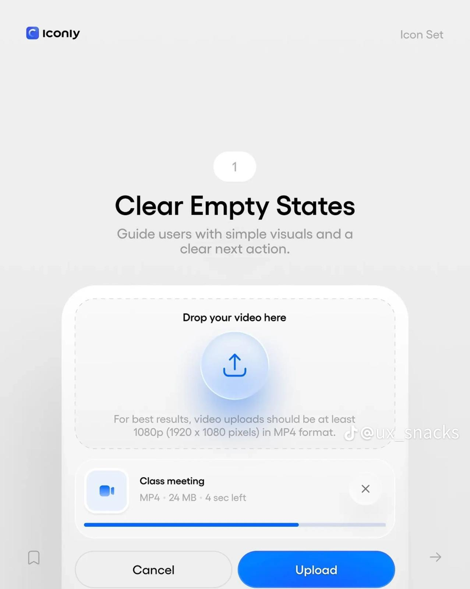
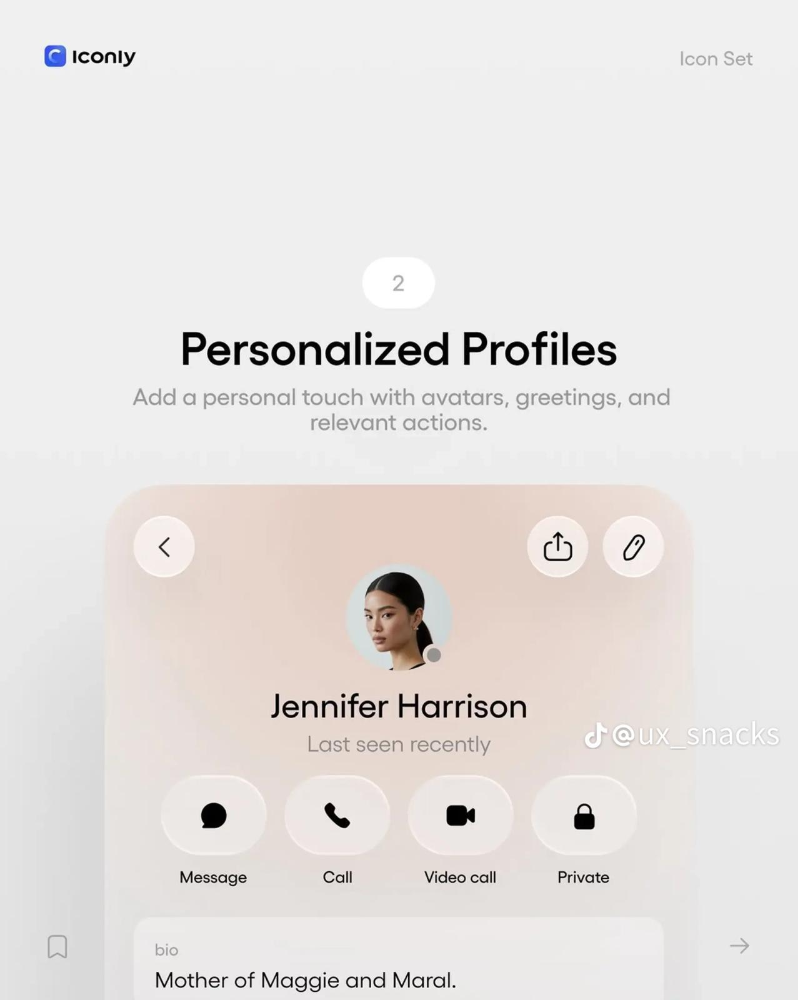
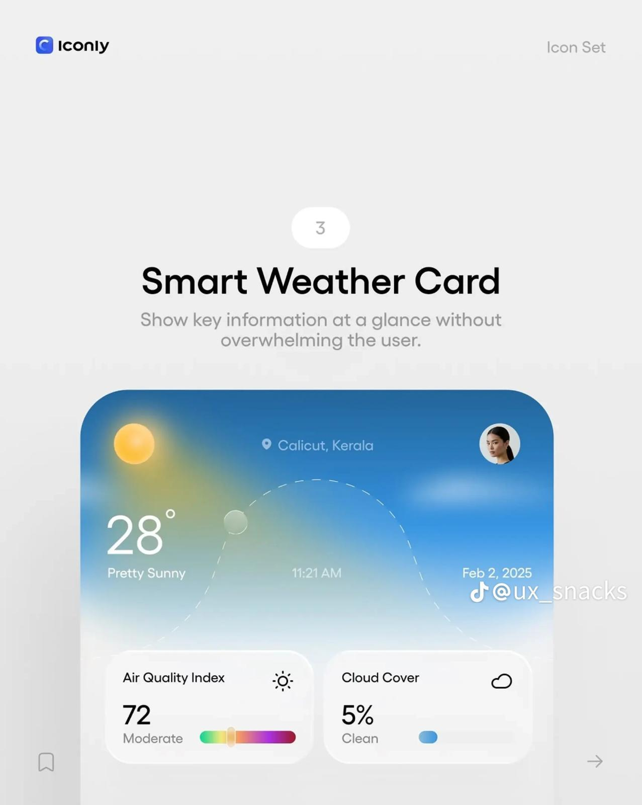
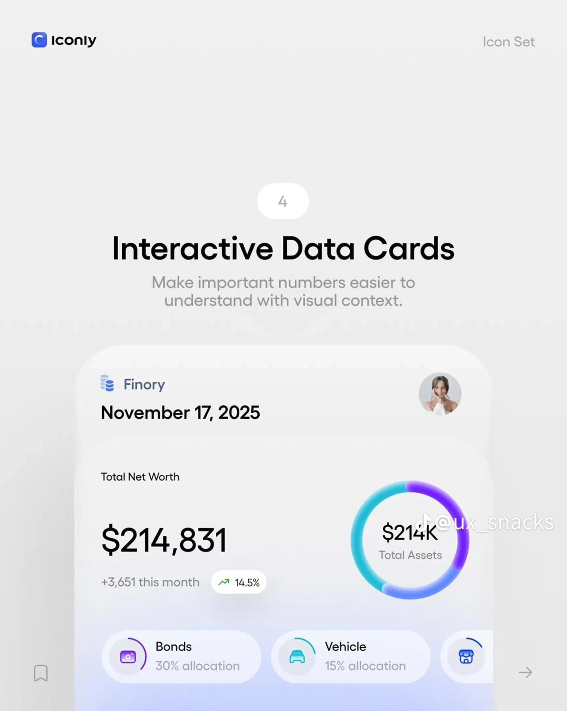
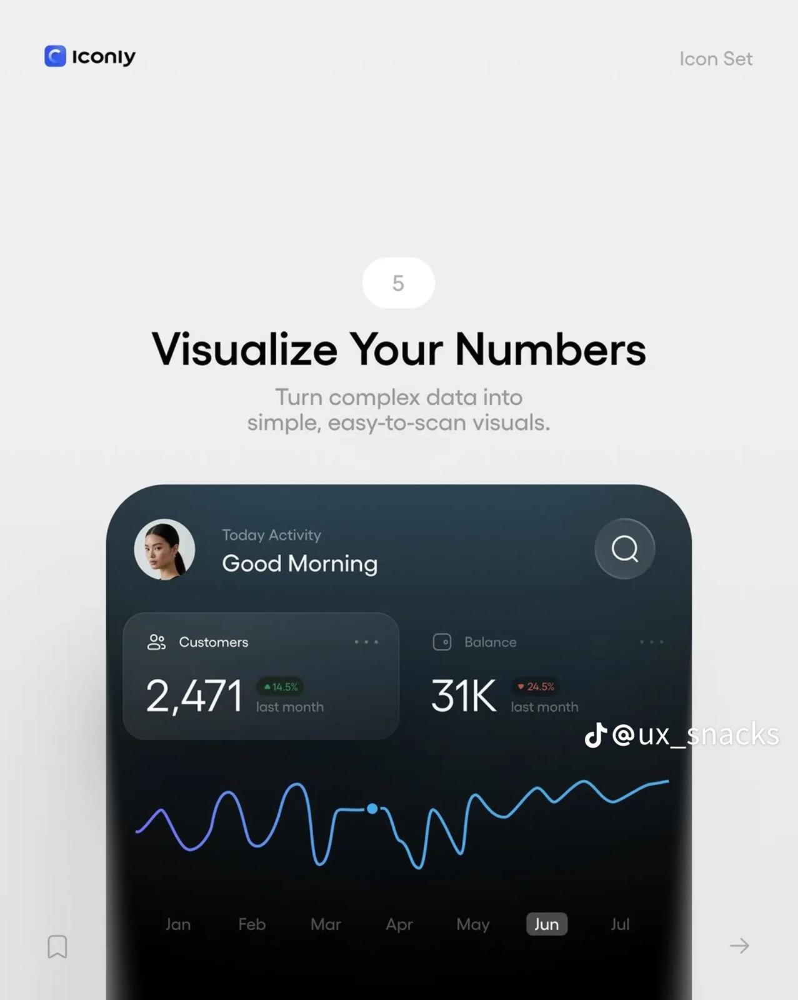
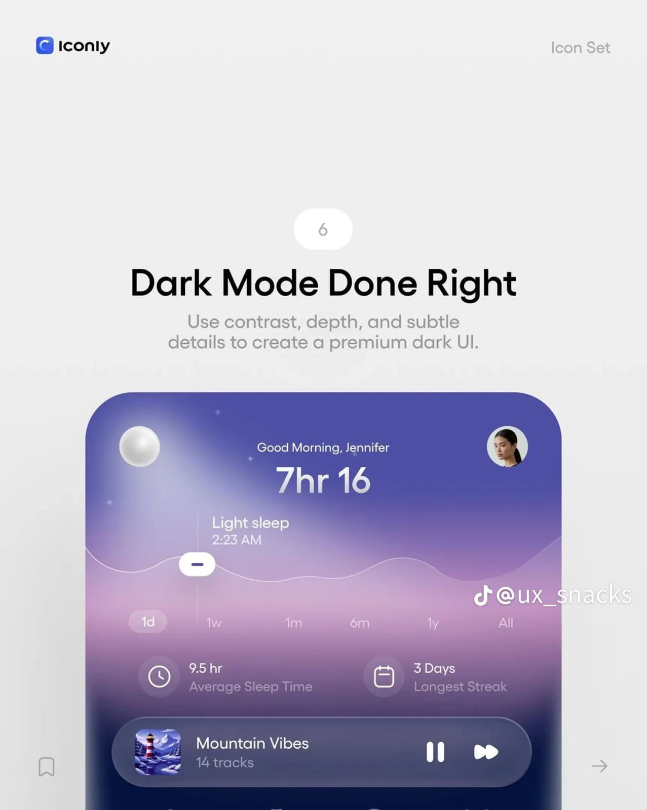
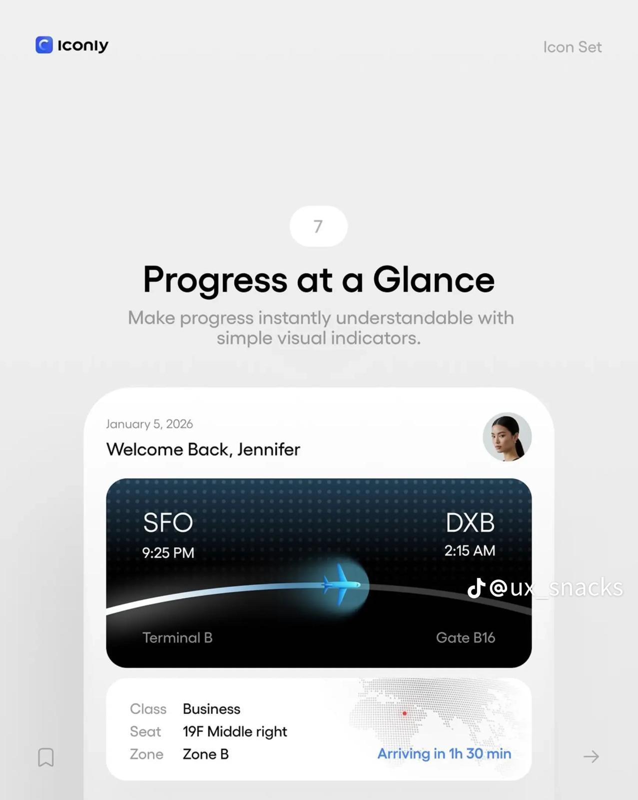
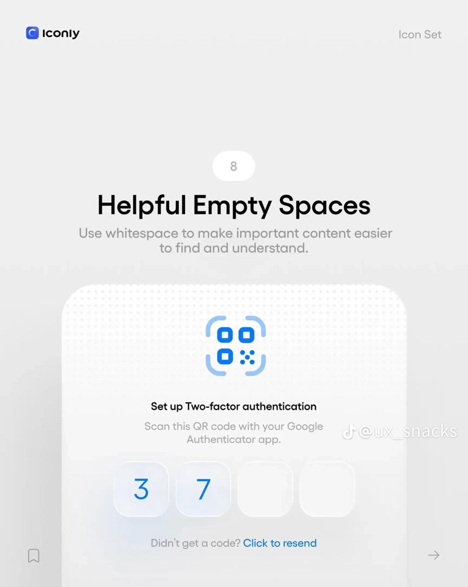
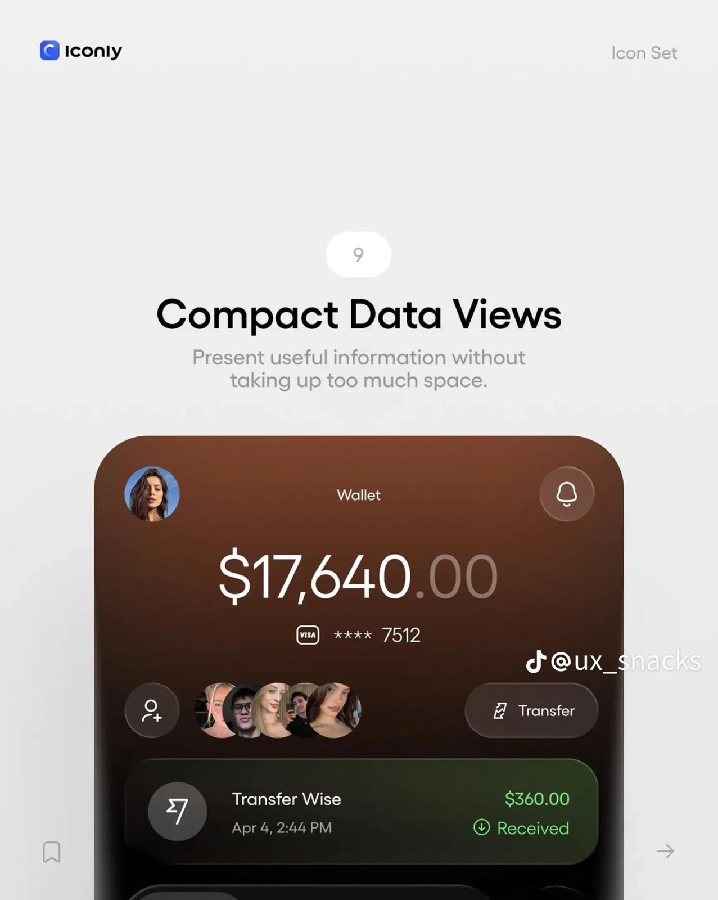
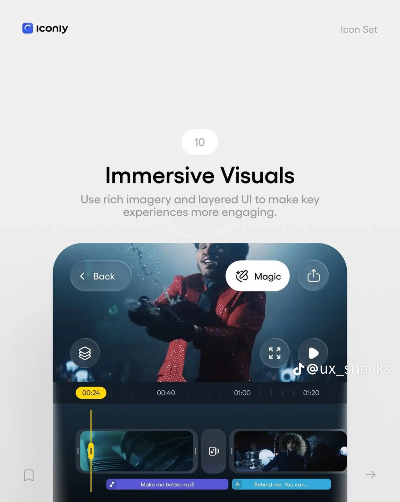

# UI/UX-Inspiration — zehn Bildreferenzen

Vom Nutzer am 30.09.2026 bereitgestellt. Sichtbare Kennzeichnungen: Iconly und @ux_snacks; Original-URL und Urheberschaft nicht verifiziert.

## Verwendung bei Designaufträgen

Diese Sammlung bei passenden Website-, Formular- und UI-Aufträgen als Inspiration berücksichtigen. Besonders relevant: klare Hierarchie, großzügiger Weißraum, abgerundete Karten, weiche Verläufe, dezente Tiefe und eindeutig beschriftete Aktionen. Northframe-Farben und Typografie bleiben die Markenbasis.

Bilder sind Referenzen, keine neuen Produktanforderungen und keine zur Veröffentlichung freigegebenen Assets. Motive und UI nicht blind kopieren. Die teils blassen Kontraste nicht übernehmen; mobile Lesbarkeit, Tastaturbedienung und reduzierte Bewegung mitdenken.

## Klare Leerzustände  Ein einfaches Symbol, kurze Erklärung und ein eindeutiger nächster Schritt. Für Uploads und Formular-Rückmeldungen.   
## Persönliche Kontaktkarten  Porträt, Name und beschriftete Kontaktaktionen. Auf Team- und Kontaktbereiche übertragbar; kein Kundenlogin dafür bauen.   
## Atmosphärische Informationskarten  Weiche Verläufe, eine dominante Information und kleinere ergänzende Karten. Als visuelle Hierarchie nutzen, kein Wetter-Feature ohne Bedarf.   
## Kennzahlen mit Kontext  Große Hauptzahl, ergänzende Beschriftung und ein visuell klarer Zusammenhang. Nur belegte Zahlen verwenden.   
## Übersichtliche Datenvisualisierung  Ruhiger dunkler Hintergrund, wenige Akzentfarben und klare Hervorhebung. Diagramme nur bei echten Daten; Achsen und Einheiten ergänzen.   
## Tiefe in dunklen Oberflächen  Violette Verläufe, transparente Ebenen und dezente Lichtakzente. Für dunkle Hero-Bereiche; Textkontrast separat prüfen.   
## Fortschritt sichtbar machen  Ein klarer Weg mit aktueller Position und ergänzenden Details. Übertragbar auf Anfrage-Schritte oder die Darstellung eines Projektablaufs.   
## Weißraum und Fokus  Großzügige Abstände, gruppierte Eingaben und eine sichtbare Hilfsaktion. Auf Kontaktformulare übertragen; keine eigene Authentifizierung erforderlich.   
## Kompakte Informationskarten  Eine dominante Information, untergeordnete Details und eine klare Aktion. Für Leistungs- oder Angebotskarten nutzbar.   
## Immersive Bilder und Ebenen  Großes Bild mit sparsam darüberliegenden Bedienelementen. Für Projektgalerien und Video-Teaser; Bedienbarkeit und mobile Lesbarkeit erhalten.   
